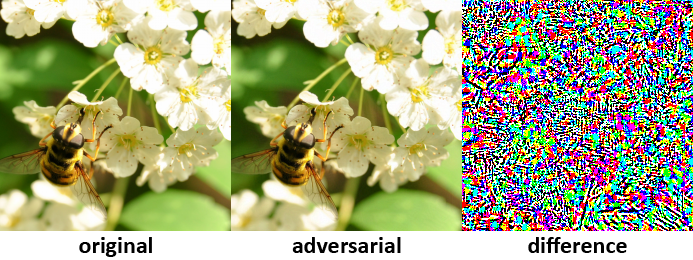

## Adversarial example generator

This script generates adversarial examples for convolutional neural networks
using `fast gradient sign method` presented in `Explaining and harnessing
adversarial examples` (Goodfellow et al. 2015).


### Dependency

This script requires trained [OverFeat](https://github.com/sermanet/OverFeat) network.
Running the `example.lua` or the snippet will automatically create the model
and download other files.

```bash
git clone https://github.com/jhjin/overfeat-torch
cd overfeat-torch
echo "torch.save('model.net', net)" >> run.lua
. install.sh
th run.lua
mv model.net bee.jpg overfeat_label.lua ..
cd ..
```


### Example

The example script predicts the output category of original and its adversarial examples.

```bash
th example.lua
```


