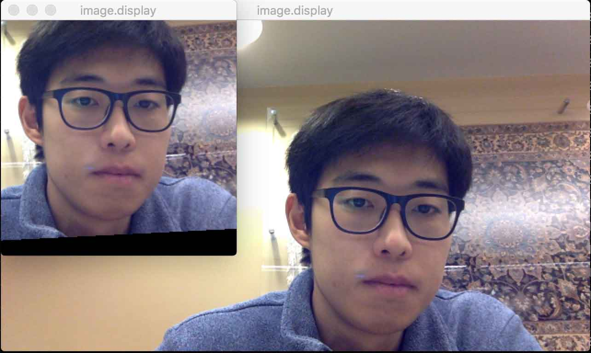

## FaceAligment-Torch7 binding

This is a binding for the implementation 
"One Millisecond Face Alignment with an Ensemble of Regression Trees" by Vahid Kazemi and Josephine Sullivan
included in `dlib` library.


### Dependencies

You need to check the following packages installed on your machine, for example, on ubuntu.

```bash
sudo apt-get install libavcodec-dev libavformat-dev libavutil-dev libssl-dev libswscale-dev
```

And on mac.

```bash
brew install ffmpeg openssl
luarocks install camera
```


### Setup

Make sure to check if the environment variable `$TORCH` in two `Makefile`s
(under `libface` and `libvideo`) points to the installed path of `Torch`.
If you have used default `Torch` installation (`$HOME/torch`),
just trigger the shell script to prepare required files.

```bash
. setup.sh
```


### Test

Run the script below.

```bash
qlua test-camera.lua              # use camera input
qlua test-image.lua image.jpg     # use static image
```


